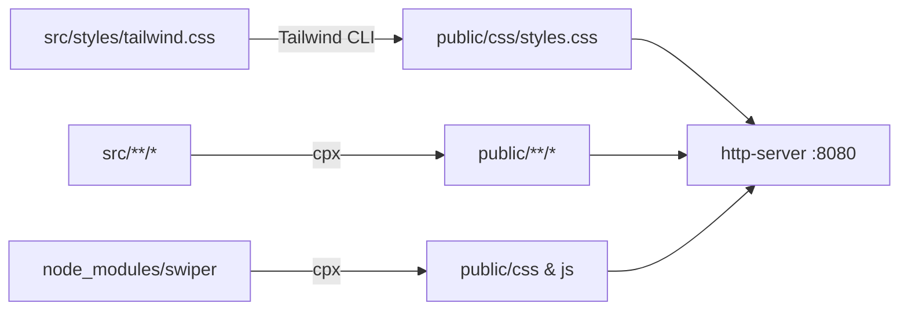
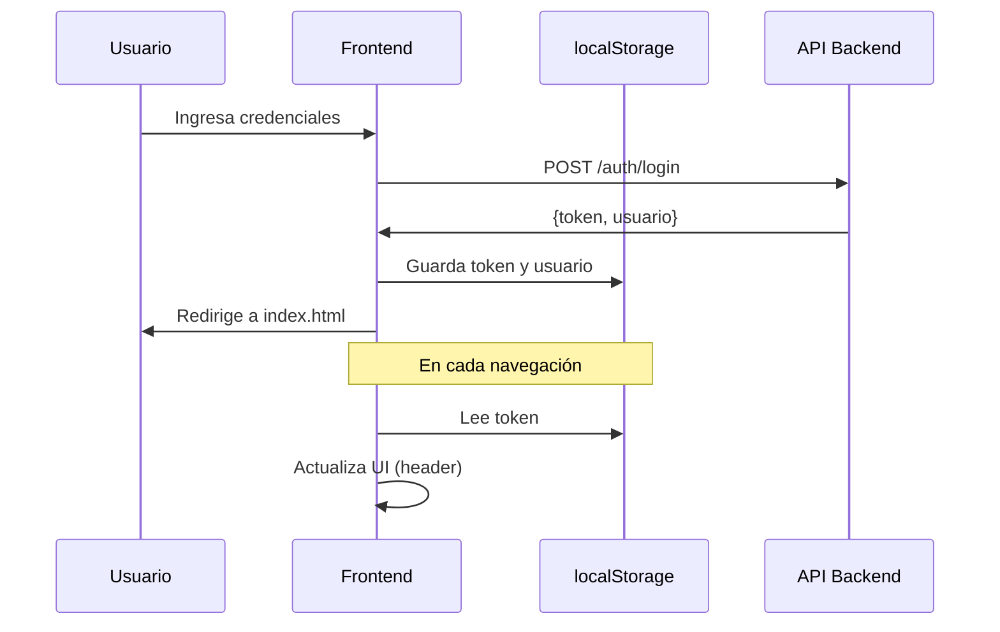

# Manual Técnico - Sistema Frontend Ferretería

**Proyecto:** PractProf2Frontend  
**Repositorio:** https://github.com/matuxer/PractProf2Frontend  
**Rama principal:** main  
**Rama de desarrollo:** develop  
**Versión:** 1.0.0  
**Fecha:** Noviembre 2025

---

## 📋 Tabla de Contenidos

1. [Descripción General](#1-descripción-general)
2. [Arquitectura del Sistema](#2-arquitectura-del-sistema)
3. [Stack Tecnológico](#3-stack-tecnológico)
4. [Estructura del Proyecto](#4-estructura-del-proyecto)
5. [Configuración y Build](#5-configuración-y-build)
6. [Módulos y Componentes](#6-módulos-y-componentes)
7. [Sistema de Autenticación](#7-sistema-de-autenticación)
8. [Gestión de Estado](#8-gestión-de-estado)
9. [API y Endpoints](#9-api-y-endpoints)
10. [Sistema de Navegación](#10-sistema-de-navegación)
11. [Guía de Desarrollo](#11-guía-de-desarrollo)
12. [Deployment](#12-deployment)
13. [Troubleshooting](#13-troubleshooting)

---

## 1. Descripción General

### 1.1 Propósito del Sistema

Sistema de e-commerce frontend para ferretería que permite:
- Navegación y búsqueda de productos
- Gestión de carrito de compras
- Autenticación de usuarios (clientes)
- Búsqueda y evaluación de especialistas
- Historial de compras y feedbacks
- Proceso de checkout y finalización de compras

### 1.2 Características Principales

- ✅ **SPA (Single Page Application)** con componentes reutilizables
- ✅ **Responsive Design** - Mobile-first approach
- ✅ **Autenticación JWT** con localStorage
- ✅ **API REST** integración con backend
- ✅ **Sistema de componentes** dinámicos cargados por fetch
- ✅ **Carrito persistente** en localStorage
- ✅ **Sistema de feedbacks** para especialistas
- ✅ **Perfiles de usuario** con historial completo

---

## 2. Arquitectura del Sistema

### 2.1 Patrón de Arquitectura

**Arquitectura de tres capas:**

```
┌─────────────────────────────────────┐
│     Presentación (HTML/CSS)         │
│  - Páginas estáticas                │
│  - Componentes reutilizables        │
│  - Tailwind CSS styling             │
└─────────────────────────────────────┘
              ↓
┌─────────────────────────────────────┐
│     Lógica de Negocio (JS)          │
│  - Módulos específicos por feature  │
│  - Gestión de estado (localStorage) │
│  - Validaciones cliente-side        │
└─────────────────────────────────────┘
              ↓
┌─────────────────────────────────────┐
│     Datos (API REST)                │
│  - Backend en localhost:3001        │
│  - Comunicación HTTP (fetch API)    │
│  - Formato JSON                     │
└─────────────────────────────────────┘
```

### 2.2 Flujo de Compilación (Build Pipeline)

```
src/                          →    public/
├── pages/*.html             →    *.html
├── components/*.html        →    components/*.html
├── js/*.js                  →    js/*.js
├── static/**/*              →    static/**/*
├── styles/tailwind.css      →    css/styles.css (compiled)
└── styles/custom.css        →    css/custom.css
```

**Proceso:**
1. Tailwind procesa `src/styles/tailwind.css` → `public/css/styles.css`
2. CPX copia archivos de `src/` a `public/` manteniendo estructura
3. http-server sirve contenido desde `public/` en puerto 8080

### 2.3 Modelo Cliente-Servidor

```
┌──────────────┐         HTTP/REST        ┌──────────────┐
│   Frontend   │ ←────────────────────→  │   Backend    │
│ (localhost:  │   JSON Request/Response  │ (localhost:  │
│    8080)     │                          │    3001)     │
└──────────────┘                          └──────────────┘
       │                                         │
       ↓                                         ↓
┌──────────────┐                          ┌──────────────┐
│ localStorage │                          │   Database   │
│  - token     │                          │              │
│  - usuario   │                          │              │
│  - carrito   │                          │              │
└──────────────┘                          └──────────────┘
```

---

## 3. Stack Tecnológico

### 3.1 Frontend Core

| Tecnología | Versión | Propósito |
|-----------|---------|-----------|
| HTML5 | - | Estructura de páginas |
| CSS3 | - | Estilos base |
| JavaScript (Vanilla) | ES6+ | Lógica de aplicación |
| Tailwind CSS | ^3.4.0 | Framework CSS utility-first |

### 3.2 Librerías y Dependencias

#### Producción
```json
{
  "swiper": "^11.2.6"  // Carruseles/sliders de imágenes
}
```

#### Desarrollo
```json
{
  "tailwindcss": "^3.4.0",      // Framework CSS
  "concurrently": "^8.0.0",      // Ejecutar múltiples comandos
  "cpx": "^1.5.0",               // Copiar archivos con watch
  "http-server": "^14.1.1"       // Servidor HTTP local
}
```

### 3.3 Herramientas de Build

- **Node.js** - Runtime environment
- **npm** - Package manager
- **Tailwind CLI** - Compilador CSS
- **cpx** - File watcher y copy
- **http-server** - Servidor estático

### 3.4 Librerías Externas (CDN)

- **Alpine.js** (v3) - Interactividad reactiva ligera
- **Font Awesome** (v6.5.2) - Iconos
- **Google Fonts** - Fuente Manrope

---

## 4. Estructura del Proyecto

### 4.1 Árbol Completo

```
ferreteria/frontend/
│
├── src/                          # 📁 Código fuente (desarrollo)
│   ├── components/               # 🧩 Componentes reutilizables
│   │   ├── header.html          # Header con navegación y auth
│   │   ├── footer.html          # Footer global
│   │   ├── especialistaCard.html # Card de especialista
│   │   ├── productCard.html     # Card de producto
│   │   └── mobileDropdownMenu.html # Menú móvil
│   │
│   ├── pages/                    # 📄 Páginas HTML
│   │   ├── index.html           # Página principal
│   │   ├── productos.html       # Listado de productos
│   │   ├── carrito.html         # Carrito de compras
│   │   ├── checkout.html        # Proceso de pago
│   │   ├── login.html           # Inicio de sesión
│   │   ├── registro.html        # Registro de usuario
│   │   ├── especialistas.html   # Listado de especialistas
│   │   ├── especialista-detalle.html # Detalle especialista + feedbacks
│   │   ├── perfil.html          # Perfil del cliente
│   │   └── 404.html             # Página de error
│   │
│   ├── js/                       # ⚡ Scripts JavaScript
│   │   ├── script.js            # Utilidades globales (UX/DOM)
│   │   ├── loadComponents.js    # Carga dinámica componentes
│   │   ├── auth.js              # Lógica de autenticación
│   │   ├── login.js             # Formulario login
│   │   ├── registro.js          # Formulario registro
│   │   ├── header-session-inline.js # UI autenticación header
│   │   ├── fetchProducts.js     # Obtener productos API
│   │   ├── fetchEspecialistas.js # Obtener especialistas API
│   │   ├── renderEspecialista.js # Renderizar cards especialistas
│   │   ├── addToCart.js         # Añadir productos al carrito
│   │   ├── carrito.js           # Lógica del carrito
│   │   ├── especialista-detalle.js # Detalle especialista + feedback
│   │   └── perfil.js            # Perfil de cliente
│   │
│   ├── static/                   # 🖼️ Recursos estáticos
│   │   └── images/              # Imágenes del sitio
│   │       ├── brands/          # Logos de marcas
│   │       ├── main-slider/     # Imágenes slider principal
│   │       ├── products/        # Imágenes de productos
│   │       ├── single-product/  # Imágenes detalle producto
│   │       └── social_icons/    # Iconos redes sociales
│   │
│   └── styles/                   # 🎨 Estilos CSS
│       ├── tailwind.css         # Configuración Tailwind
│       └── custom.css           # Estilos personalizados
│
├── public/                       # 🌐 Build output (GENERADO - NO EDITAR)
│   ├── *.html                   # Páginas compiladas
│   ├── components/              # Componentes copiados
│   ├── js/                      # Scripts copiados
│   ├── static/                  # Assets copiados
│   └── css/                     # CSS compilado
│       ├── styles.css           # Tailwind compilado
│       ├── custom.css           # Custom CSS
│       └── swiper-bundle.*      # Librería Swiper
│
├── node_modules/                 # 📦 Dependencias npm
│
├── package.json                  # 📋 Configuración proyecto
├── package-lock.json            # 🔒 Lock de dependencias
├── tailwind.config.cjs          # ⚙️ Configuración Tailwind
├── .gitignore                   # 🚫 Archivos ignorados Git
└── README.md                    # 📖 Documentación usuario
```

### 4.2 Descripción de Directorios Clave

#### `src/components/`
Componentes HTML reutilizables cargados dinámicamente por `loadComponents.js`.
- Uso de plantillas con sintaxis `{{variable}}`
- Se insertan en placeholders con ID específicos
- Permiten mantener consistencia visual

#### `src/pages/`
Páginas completas del sitio. Cada archivo HTML representa una ruta accesible.
- Importan componentes mediante placeholders `<div id="header-placeholder"></div>`
- Cargan scripts específicos según funcionalidad
- Incluyen Tailwind CSS y custom.css

#### `src/js/`
Módulos JavaScript organizados por responsabilidad:
- **Utils globales:** `script.js`, `loadComponents.js`
- **Autenticación:** `auth.js`, `login.js`, `registro.js`, `header-session-inline.js`
- **Productos:** `fetchProducts.js`, `addToCart.js`
- **Especialistas:** `fetchEspecialistas.js`, `renderEspecialista.js`, `especialista-detalle.js`
- **Carrito:** `carrito.js`
- **Perfil:** `perfil.js`

#### `src/static/`
Assets estáticos (imágenes, iconos). Estructura organizada por tipo.

#### `src/styles/`
- `tailwind.css`: Configuración e imports de Tailwind
- `custom.css`: Estilos adicionales no cubiertos por Tailwind

---

## 5. Configuración y Build

### 5.1 Configuración Tailwind (`tailwind.config.cjs`)

```javascript
module.exports = {
  content: [
    "./public/**/*.html",
    "./src/**/*.js"
  ],
  theme: {
    extend: {
      colors: {
        'gray-dark': '#010717',
        'primary': '#e1592c',      // Color principal (naranja)
        'gray-lighter': '#FAF7F3',
        'gray-light': '#323232',
        'gray-txt': '#4c4d56',
        'gray-line': '#E5E5E5'
      },
      fontFamily: {
        'display': ['Manrope', 'sans-serif']
      }
    }
  },
  plugins: []
}
```

**Variables de color personalizadas:**
- `primary` (#e1592c) - Color identitario de la marca (naranja)
- Escala de grises custom para mejor control visual

### 5.2 Scripts NPM

#### Desarrollo
```bash
npm run dev
```
**Ejecuta concurrentemente:**
- `tailwind:watch` - Compila Tailwind en modo watch
- `watch:copy-pages` - Observa y copia páginas
- `watch:copy-components` - Observa y copia componentes
- `watch:copy-js` - Observa y copia JS
- `watch:copy-static` - Observa y copia assets
- `watch:copy-css` - Observa y copia custom.css
- `serve` - Servidor HTTP en puerto 8080

#### Producción
```bash
npm run build
```
**Ejecuta:**
1. `build:css` - Compila y minifica Tailwind
2. `build:copy` - Copia todos los archivos a `public/`

#### Otros comandos
```bash
npm run serve              # Solo servidor HTTP
npm run tailwind:watch     # Solo compilación Tailwind
npm run build:css          # Solo build CSS
npm run build:copy         # Solo copiar archivos
```

### 5.3 Flujo de Build



---

## 6. Módulos y Componentes

### 6.1 Sistema de Componentes

#### Cargador de Componentes (`loadComponents.js`)

```javascript
async function loadComponent(id, file) {
    const response = await fetch(file);
    const html = await response.text();
    const element = document.getElementById(id);
    if (element) {
        element.innerHTML = html;
    }
}
```

**Flujo:**
1. Cada página tiene placeholders: `<div id="header-placeholder"></div>`
2. `loadComponents.js` ejecuta en DOMContentLoaded
3. Hace fetch de componentes desde `../components/`
4. Inserta HTML en placeholder correspondiente
5. Emite evento `componentsLoaded` para sincronización

**Uso en páginas:**
```html
<div id="header-placeholder"></div>
<div id="footer-placeholder"></div>
<script src="../js/loadComponents.js"></script>
```

#### Renderizado de Templates

**Especialistas (`renderEspecialista.js`):**
```javascript
function renderEspecialista(especialista, template) {
  let html = template
    .replace(/{{id}}/g, especialista.id)
    .replace(/{{nombre}}/g, especialista.nombre)
    .replace(/{{perfilImgUrl}}/g, imgUrl)
    // ... más reemplazos
  
  // Manejo de condicionales {{#if}}...{{/if}}
  // Manejo de loops {{#each}}...{{/each}}
  
  return html;
}
```

**Sistema de plantillas simple:**
- Variables: `{{nombreVariable}}`
- Condicionales: `{{#if condicion}}...{{else}}...{{/if}}`
- Loops: `{{#each items}}...{{/each}}`

### 6.2 Componentes Principales

#### Header (`header.html`)

**Funcionalidades:**
- Navegación principal (Inicio, Productos, Especialistas)
- Autenticación (Login/Registro o Perfil/Logout)
- Ícono de carrito
- Menú hamburguesa responsive

**Estados dinámicos:**
```javascript
// NO logueado
#auth-buttons-desktop/mobile → visible
#user-info-desktop/mobile → hidden

// Logueado
#auth-buttons-desktop/mobile → hidden
#user-info-desktop/mobile → visible (muestra nombre usuario)
```

**Controlado por:** `header-session-inline.js`

#### Footer (`footer.html`)

**Contenido:**
- Información de contacto
- Enlaces rápidos
- Redes sociales
- Copyright

#### Product Card (`productCard.html`)

**Datos requeridos:**
```javascript
{
  id: number,
  nombre: string,
  precio: number,
  imgUrl: string,
  categoria: string
}
```

**Eventos:**
- Click en card → `producto.html?id={id}` (deshabilitado - sin detalle)
- Click en "Añadir al carrito" → `addToCart.js`

#### Especialista Card (`especialistaCard.html`)

**Datos requeridos:**
```javascript
{
  id: number,
  nombre: string,
  apellido: string,
  oficio: { nombre: string, categoria: string },
  puntuacion: number (1-5),
  disponibilidad: boolean,
  perfilImgUrl: string
}
```

**Eventos:**
- Click en card → `especialista-detalle.html?id={id}`

### 6.3 Páginas Principales

#### Index (`index.html`)
- Slider principal (Swiper)
- Grid de productos destacados
- Sección "Nuestros Productos"

#### Productos (`productos.html`)
- Listado completo de productos
- Grid responsive
- Integración con `fetchProducts.js`

#### Carrito (`carrito.html`)
- Tabla de productos agregados
- Cálculo de totales
- Botones condicionales según autenticación:
  - **No logueado:** Link a login
  - **Logueado:** Botón "Finalizar Compra"

**Funcionalidades clave:**
```javascript
// Renderizar carrito desde localStorage
function renderCart() {
  const carrito = JSON.parse(localStorage.getItem('carrito')) || [];
  // Renderizar items, calcular totales
}

// Finalizar compra (POST /compra/finalizar)
async function finalizarCompra() {
  const usuario = getUserData();
  const carrito = getCarrito();
  
  const response = await fetch(`${API_URL}/compra/finalizar`, {
    method: 'POST',
    headers: { 'Content-Type': 'application/json' },
    body: JSON.stringify({ clienteId: usuario.id, carrito })
  });
  
  // Limpiar carrito y recargar
}
```

#### Especialistas (`especialistas.html`)
- Grid de cards de especialistas
- Fetch desde `/especialistas`
- Renderizado con `renderEspecialista.js`

#### Especialista Detalle (`especialista-detalle.html`)
- Información completa del especialista
- Lista de feedbacks recibidos
- Modal para agregar feedback (solo logueados)

**Flujo de feedback:**
```javascript
// 1. Usuario logueado click "Agregar Feedback"
openFeedbackModal();

// 2. Selecciona estrellas (1-5) y escribe comentario
// 3. Submit → POST /feedbacks/crear
{
  clienteId: usuario.id,
  especialistaId: especialista.id,
  clasificacion: 1-5,
  comentario: "texto..."
}

// 4. Recarga datos del especialista (muestra nuevo feedback)
```

#### Perfil (`perfil.html`)
- Información personal del cliente
- Tabs: Historial de Compras / Feedbacks Escritos
- Fetch desde `/clientes/{id}`

**Estructura de datos:**
```javascript
{
  id, nombre, apellido, correo, telefono,
  puntosRecompensa,
  domicilio, localidad, provincia, pais,
  compras: [...],
  feedbacksEscritos: [...]
}
```

#### Login (`login.html`)
- Formulario de inicio de sesión
- Validación cliente-side
- POST `/auth/login` → recibe token + usuario
- Almacena en localStorage
- Redirige a index

#### Registro (`registro.html`)
- Formulario de registro de cliente
- Validación de campos
- POST `/clientes/crear`
- Auto-login después de registro exitoso

#### 404 (`404.html`)
- Página de error personalizada
- Temática de ferretería (iconos de herramientas)
- Links rápidos a secciones principales

---

## 7. Sistema de Autenticación

### 7.1 Flujo de Autenticación



### 7.2 Módulos de Autenticación

#### `auth.js` - Funciones Core

```javascript
// Login
async function login(correo, contrasena) {
  const response = await fetch(`${API_URL}/auth/login`, {
    method: 'POST',
    headers: { 'Content-Type': 'application/json' },
    body: JSON.stringify({ correo, contrasena })
  });
  
  const data = await response.json();
  
  localStorage.setItem('token', data.token);
  localStorage.setItem('usuario', JSON.stringify(data.usuario));
  
  return data;
}

// Logout
function logout() {
  localStorage.removeItem('token');
  localStorage.removeItem('usuario');
  window.location.href = 'index.html';
}

// Verificar autenticación
function isAuthenticated() {
  return localStorage.getItem('token') !== null;
}

// Obtener usuario actual
function getCurrentUser() {
  const usuarioStr = localStorage.getItem('usuario');
  return usuarioStr ? JSON.parse(usuarioStr) : null;
}
```

#### `header-session-inline.js` - UI del Header

```javascript
function updateHeaderUI() {
  const token = localStorage.getItem('token');
  const usuario = JSON.parse(localStorage.getItem('usuario'));
  
  const authButtons = document.querySelectorAll('#auth-buttons-desktop, #auth-buttons-mobile');
  const userInfo = document.querySelectorAll('#user-info-desktop, #user-info-mobile');
  
  if (token && usuario) {
    // Mostrar nombre usuario, ocultar botones registro/login
    authButtons.forEach(el => el.classList.add('hidden'));
    userInfo.forEach(el => {
      el.classList.remove('hidden');
      el.querySelector('#user-name-desktop, #user-name-mobile')
        .textContent = usuario.nombre;
    });
  } else {
    // Mostrar botones registro/login
    userInfo.forEach(el => el.classList.add('hidden'));
    authButtons.forEach(el => el.classList.remove('hidden'));
  }
}

// Ejecutar en componentsLoaded y DOMContentLoaded
window.addEventListener('componentsLoaded', updateHeaderUI);
document.addEventListener('DOMContentLoaded', updateHeaderUI);
```

### 7.3 Almacenamiento Local

**Estructura localStorage:**

```javascript
{
  "token": "eyJhbGciOiJIUzI1NiIsInR5cCI6IkpXVCJ9...",
  "usuario": "{\"id\":123,\"nombre\":\"Juan\",\"correo\":\"juan@example.com\"}",
  "carrito": "[{\"productoId\":45,\"cantidad\":2,\"nombre\":\"...\"}]"
}
```

**Ciclo de vida:**
- **Login:** Se guardan `token` y `usuario`
- **Navegación:** Se lee `token` para mostrar UI apropiada
- **Logout:** Se eliminan ambos y se limpia carrito
- **Expiración:** No se valida expiración en frontend (backend lo maneja)

### 7.4 Protección de Rutas

**Implementación simple:**

```javascript
// En páginas protegidas (perfil.html, checkout.html)
function checkAuth() {
  const token = localStorage.getItem('token');
  if (!token) {
    window.location.href = 'login.html';
    return false;
  }
  return true;
}

document.addEventListener('DOMContentLoaded', () => {
  if (!checkAuth()) return;
  // Continuar carga de página
});
```

---

## 8. Gestión de Estado

### 8.1 LocalStorage como Store

**No se usa Redux/Vuex/Context API**, solo localStorage nativo.

#### Estado Global

```javascript
// Autenticación
localStorage.token           // JWT token
localStorage.usuario         // Objeto usuario serializado

// Carrito
localStorage.carrito         // Array de items serializado

// Lectura
const token = localStorage.getItem('token');
const usuario = JSON.parse(localStorage.getItem('usuario'));
const carrito = JSON.parse(localStorage.getItem('carrito')) || [];

// Escritura
localStorage.setItem('carrito', JSON.stringify(carritoArray));

// Borrado
localStorage.removeItem('token');
localStorage.clear(); // Borra todo
```

### 8.2 Carrito de Compras

#### Estructura de Datos

```javascript
[
  {
    productoId: 45,
    nombre: "Martillo Carpintero 16oz",
    precio: 15.99,
    cantidad: 2,
    imgUrl: "http://localhost:3001/images/productos/martillo.jpg"
  },
  {
    productoId: 78,
    nombre: "Destornillador Set 5 Piezas",
    precio: 24.50,
    cantidad: 1,
    imgUrl: "..."
  }
]
```

#### Operaciones CRUD

**Añadir producto (`addToCart.js`):**
```javascript
function addToCart(producto, cantidad = 1) {
  let carrito = JSON.parse(localStorage.getItem('carrito')) || [];
  
  const existingIndex = carrito.findIndex(item => item.productoId === producto.id);
  
  if (existingIndex !== -1) {
    // Incrementar cantidad si ya existe
    carrito[existingIndex].cantidad += cantidad;
  } else {
    // Agregar nuevo item
    carrito.push({
      productoId: producto.id,
      nombre: producto.nombre,
      precio: producto.precio,
      cantidad: cantidad,
      imgUrl: producto.imgUrl
    });
  }
  
  localStorage.setItem('carrito', JSON.stringify(carrito));
  showMessage('Producto agregado al carrito', 'success');
}
```

**Actualizar cantidad:**
```javascript
function updateCartItemQuantity(productoId, nuevaCantidad) {
  let carrito = JSON.parse(localStorage.getItem('carrito')) || [];
  const index = carrito.findIndex(item => item.productoId === productoId);
  
  if (index !== -1) {
    if (nuevaCantidad <= 0) {
      carrito.splice(index, 1); // Eliminar si cantidad es 0
    } else {
      carrito[index].cantidad = nuevaCantidad;
    }
  }
  
  localStorage.setItem('carrito', JSON.stringify(carrito));
  renderCart(); // Re-renderizar
}
```

**Eliminar producto:**
```javascript
function removeFromCart(productoId) {
  let carrito = JSON.parse(localStorage.getItem('carrito')) || [];
  carrito = carrito.filter(item => item.productoId !== productoId);
  localStorage.setItem('carrito', JSON.stringify(carrito));
  renderCart();
}
```

**Vaciar carrito:**
```javascript
function clearCart() {
  localStorage.removeItem('carrito');
  renderCart();
}
```

#### Cálculos

```javascript
function calcularTotal() {
  const carrito = JSON.parse(localStorage.getItem('carrito')) || [];
  
  const subtotal = carrito.reduce((sum, item) => {
    return sum + (item.precio * item.cantidad);
  }, 0);
  
  const descuento = 0; // Aplicar lógica de descuentos
  const total = subtotal - descuento;
  
  return { subtotal, descuento, total };
}
```

---

## 9. API y Endpoints

### 9.1 Base URL

```javascript
const API_URL = 'http://localhost:3001';
```

### 9.2 Endpoints Utilizados

#### Autenticación

**POST /auth/login**
```javascript
// Request
{
  "correo": "juan@example.com",
  "contrasena": "password123"
}

// Response 200 OK
{
  "token": "eyJhbGciOiJIUzI1NiIsInR5cCI6IkpXVCJ9...",
  "usuario": {
    "id": 123,
    "nombre": "Juan",
    "apellido": "Pérez",
    "correo": "juan@example.com"
  }
}
```

#### Clientes

**POST /clientes/crear** (Registro)
```javascript
// Request
{
  "nombre": "Juan",
  "apellido": "Pérez",
  "correo": "juan@example.com",
  "contrasena": "password123",
  "telefono": "1234567890"
}

// Response 201 Created
{
  "id": 123,
  "nombre": "Juan",
  "apellido": "Pérez",
  "correo": "juan@example.com"
}
```

**GET /clientes/{id}** (Perfil)
```javascript
// Response 200 OK
{
  "id": 123,
  "nombre": "Juan",
  "apellido": "Pérez",
  "correo": "juan@example.com",
  "telefono": "1234567890",
  "puntosRecompensa": 150,
  "domicilio": "Calle Falsa 123",
  "localidad": "CABA",
  "provincia": "Buenos Aires",
  "pais": "Argentina",
  "compras": [...],
  "feedbacksEscritos": [...]
}
```

#### Productos

**GET /productos**
```javascript
// Response 200 OK
[
  {
    "id": 45,
    "nombre": "Martillo Carpintero 16oz",
    "precioUnitario": 15.99,
    "imgUrl": "/images/productos/martillo.jpg",
    "categoria": "Herramientas",
    "stock": 50
  },
  ...
]
```

#### Especialistas

**GET /especialistas**
```javascript
// Response 200 OK
[
  {
    "id": 10,
    "nombre": "Carlos",
    "apellido": "Gómez",
    "oficio": {
      "id": 1,
      "nombre": "Electricista",
      "categoria": "Instalaciones"
    },
    "disponibilidad": true,
    "puntuacion": 5,
    "perfilImgUrl": "/images/especialistas/carlos.jpg"
  },
  ...
]
```

**GET /especialistas/{id}**
```javascript
// Response 200 OK
{
  "id": 10,
  "nombre": "Carlos",
  "apellido": "Gómez",
  "oficio": "Electricista",
  "disponibilidad": true,
  "puntuacion": 5,
  "perfilImgUrl": "/images/especialistas/carlos.jpg",
  "feedbacksRecibidos": [
    {
      "id": 101,
      "fecha": "2025-11-05",
      "clasificacion": 5,
      "comentario": "Excelente servicio",
      "cliente": {
        "id": 123,
        "nombre": "Juan",
        "apellido": "Pérez"
      }
    },
    ...
  ]
}
```

#### Feedbacks

**POST /feedbacks/crear**
```javascript
// Request
{
  "clienteId": 123,
  "especialistaId": 10,
  "clasificacion": 5,
  "comentario": "Excelente trabajo, muy profesional"
}

// Response 200 OK
{
  "id": 102,
  "fecha": "2025-11-11",
  "clasificacion": 5,
  "comentario": "Excelente trabajo, muy profesional"
}
```

#### Compras

**POST /compra/finalizar**
```javascript
// Request
{
  "clienteId": 123,
  "carrito": [
    {
      "productoId": 45,
      "cantidad": 2,
      "precio": 15.99
    },
    {
      "productoId": 78,
      "cantidad": 1,
      "precio": 24.50
    }
  ]
}

// Response 200 OK
{
  "id": 456,
  "fecha": "2025-11-11",
  "total": 56.48,
  "descuento": 0.0,
  "items": [...]
}
```

### 9.3 Manejo de Errores

```javascript
async function apiCall() {
  try {
    const response = await fetch(`${API_URL}/endpoint`, {
      method: 'POST',
      headers: { 'Content-Type': 'application/json' },
      body: JSON.stringify(data)
    });
    
    if (!response.ok) {
      const errorText = await response.text();
      throw new Error(errorText || `Error ${response.status}`);
    }
    
    return await response.json();
    
  } catch (error) {
    console.error('API Error:', error);
    showMessage(error.message, 'error');
    throw error;
  }
}
```

**Códigos de estado comunes:**
- `200 OK` - Éxito
- `201 Created` - Recurso creado
- `400 Bad Request` - Validación fallida
- `404 Not Found` - Recurso no encontrado
- `500 Internal Server Error` - Error del servidor

---

## 10. Sistema de Navegación

### 10.1 Rutas Principales

| Ruta | Archivo | Descripción |
|------|---------|-------------|
| `/` o `/index.html` | index.html | Página principal |
| `/productos.html` | productos.html | Listado de productos |
| `/carrito.html` | carrito.html | Carrito de compras |
| `/login.html` | login.html | Inicio de sesión |
| `/registro.html` | registro.html | Registro de usuario |
| `/especialistas.html` | especialistas.html | Listado especialistas |
| `/especialista-detalle.html?id=X` | especialista-detalle.html | Detalle especialista |
| `/perfil.html` | perfil.html | Perfil cliente (protegido) |
| `/404.html` | 404.html | Página de error |

### 10.2 Navegación con Parámetros

**Query Parameters:**
```javascript
// Leer parámetro de URL
const urlParams = new URLSearchParams(window.location.search);
const id = urlParams.get('id'); // especialista-detalle.html?id=10

// Construir URL con parámetro
const url = `especialista-detalle.html?id=${especialista.id}`;
```

### 10.3 Redirecciones

```javascript
// Redirigir después de login
window.location.href = 'index.html';

// Redirigir si no autenticado
if (!isAuthenticated()) {
  window.location.href = 'login.html';
}

// Redirigir con mensaje
localStorage.setItem('message', 'Compra finalizada exitosamente');
window.location.href = 'perfil.html';
```

---

## 11. Guía de Desarrollo

### 11.1 Setup Inicial

```bash
# 1. Clonar repositorio
git clone https://github.com/matuxer/PractProf2Frontend.git
cd PractProf2Frontend

# 2. Instalar dependencias
npm install

# 3. Build inicial (primera vez)
npm run build

# 4. Modo desarrollo
npm run dev
```

### 11.2 Flujo de Trabajo

**1. Crear feature branch desde develop:**
```bash
git checkout develop
git pull origin develop
git checkout -b feature/FERRF-XX-descripcion
```

**2. Desarrollo:**
- Editar archivos en `src/`
- Guardar cambios (auto-reload en navegador)
- Probar en http://localhost:8080

**3. Commits:**
```bash
git add .
git commit -m "[FERRF-XX] Descripción del cambio"
```

**4. Push y Pull Request:**
```bash
git push -u origin feature/FERRF-XX-descripcion
```
Crear PR hacia `develop` en GitHub

**5. Después del merge:**
```bash
git checkout develop
git pull origin develop
git branch -d feature/FERRF-XX-descripcion
```

### 11.3 Convenciones de Código

#### JavaScript

**Variables y funciones:**
```javascript
// camelCase para variables y funciones
const userName = 'Juan';
function getUserData() { }

// PascalCase para clases (no usado en este proyecto)
class UserService { }

// UPPER_CASE para constantes
const API_URL = 'http://localhost:3001';
const MAX_ITEMS = 100;
```

**Async/Await preferido sobre Promises:**
```javascript
// ✅ Correcto
async function fetchData() {
  const response = await fetch(url);
  const data = await response.json();
  return data;
}

// ❌ Evitar
function fetchData() {
  return fetch(url)
    .then(res => res.json())
    .then(data => data);
}
```

#### HTML

**Estructura:**
```html
<!doctype html>
<html>
<head>
    <meta charset="UTF-8">
    <meta name="viewport" content="width=device-width, initial-scale=1.0">
    <title>Título - La Casa de la Ferretería</title>
    
    <!-- Fonts -->
    <link href="https://fonts.googleapis.com/css2?family=Manrope:wght@200..800&display=swap" rel="stylesheet">
    
    <!-- Icons -->
    <link rel="stylesheet" href="https://cdnjs.cloudflare.com/ajax/libs/font-awesome/6.5.2/css/all.min.css">
    
    <!-- Styles -->
    <link rel="stylesheet" href="css/styles.css">
    <link rel="stylesheet" href="css/custom.css">
</head>
<body class="bg-gray-50">
    <!-- Header Component -->
    <div id="header-placeholder"></div>
    
    <!-- Main Content -->
    <main>
        <!-- ... -->
    </main>
    
    <!-- Footer Component -->
    <div id="footer-placeholder"></div>
    
    <!-- Scripts -->
    <script src="https://cdn.jsdelivr.net/npm/alpinejs@3.x.x/dist/cdn.min.js" defer></script>
    <script src="../js/loadComponents.js"></script>
    <script src="js/nombreEspecifico.js"></script>
    <script src="js/header-session-inline.js"></script>
</body>
</html>
```

#### CSS (Tailwind)

**Orden de clases preferido:**
```html
<!-- Layout → Spacing → Sizing → Colors → Typography → Effects -->
<div class="flex items-center justify-between p-4 w-full bg-primary text-white font-semibold rounded-lg hover:bg-opacity-90 transition-all">
```

**Responsive:**
```html
<!-- Mobile-first approach -->
<div class="w-full md:w-1/2 lg:w-1/3 xl:w-1/4">
  <!-- Full en mobile, mitad en tablet, tercio en desktop, cuarto en XL -->
</div>
```

### 11.4 Testing

**No hay framework de testing formal.**

**Testing manual recomendado:**

1. **Funcionalidad:**
   - Probar flujos de usuario end-to-end
   - Verificar integraciones con API
   - Validar manejo de errores

2. **Responsive:**
   - Probar en Chrome DevTools (varios viewports)
   - Dispositivos reales: iPhone, Android, Tablet

3. **Navegadores:**
   - Chrome (principal)
   - Firefox
   - Safari
   - Edge

4. **Checklist pre-PR:**
   - [ ] No hay errores en console
   - [ ] Funciona sin backend (graceful degradation)
   - [ ] Responsive en mobile y desktop
   - [ ] Componentes cargan correctamente
   - [ ] LocalStorage maneja casos edge
   - [ ] No hay links rotos

### 11.5 Debugging

**Herramientas útiles:**

```javascript
// Console logs estructurados
console.log('🔍 Debugging info:', { variable, otroValor });
console.error('❌ Error:', error);
console.warn('⚠️ Warning:', mensaje);

// Inspeccionar localStorage
console.table(localStorage);
console.log('Token:', localStorage.getItem('token'));
console.log('Usuario:', JSON.parse(localStorage.getItem('usuario')));

// Verificar fetch
console.log('📡 Fetching:', API_URL + endpoint);
console.log('📦 Response:', await response.json());
```

**Chrome DevTools:**
- **Elements:** Inspeccionar DOM y clases Tailwind aplicadas
- **Console:** Ver logs y ejecutar código
- **Network:** Ver peticiones HTTP, payloads, responses
- **Application → Local Storage:** Inspeccionar estado
- **Sources:** Breakpoints en JavaScript

---

## 12. Deployment

### 12.1 Build para Producción

```bash
# 1. Limpiar build anterior (opcional)
rm -rf public/

# 2. Build completo
npm run build

# Resultado: Carpeta public/ lista para deploy
```

**Contenido de `public/`:**
- Archivos HTML compilados
- CSS minificado
- JavaScript copiado
- Assets estáticos
- Librerías externas (Swiper)

### 12.2 Opciones de Deploy

#### Opción 1: GitHub Pages

```bash
# 1. Crear branch gh-pages
git checkout -b gh-pages

# 2. Build y commit
npm run build
git add public/ -f  # Forzar add (public/ está en .gitignore)
git commit -m "Deploy to GitHub Pages"

# 3. Push
git subtree push --prefix public origin gh-pages
```

Configurar en GitHub: Settings → Pages → Source: gh-pages branch

#### Opción 2: Netlify

1. Conectar repositorio en Netlify
2. Configurar build:
   - **Build command:** `npm run build`
   - **Publish directory:** `public`
3. Deploy automático en cada push a `main`

#### Opción 3: Vercel

Similar a Netlify:
```bash
npm install -g vercel
vercel --prod
```

#### Opción 4: Servidor tradicional (Apache/Nginx)

```bash
# 1. Build
npm run build

# 2. Copiar public/ al servidor
scp -r public/* user@server:/var/www/html/

# 3. Configurar servidor web para servir archivos estáticos
```

### 12.3 Variables de Entorno

**API URL:**

Crear archivo `src/js/config.js`:
```javascript
const API_URL = process.env.API_URL || 'http://localhost:3001';
export default API_URL;
```

Luego importar en módulos:
```javascript
import API_URL from './config.js';
```

**Para producción:**
```bash
export API_URL=https://api.ferreteria.com
npm run build
```

### 12.4 Optimizaciones

**CSS:**
```bash
# Tailwind ya minifica con --minify en build:css
```

**Imágenes:**
```bash
# Comprimir imágenes antes de subir a src/static/images/
# Herramientas: TinyPNG, ImageOptim, Squoosh
```

**JavaScript:**
```bash
# Considerar UglifyJS o Terser para minificar
npm install --save-dev terser
# Agregar script en package.json
```

---

## 13. Troubleshooting

### 13.1 Problemas Comunes

#### "npm: command not found"
**Causa:** Node.js no instalado  
**Solución:**
```bash
# Descargar e instalar desde nodejs.org
node --version  # Verificar instalación
npm --version
```

#### "Error: listen EADDRINUSE: address already in use :::8080"
**Causa:** Puerto 8080 ocupado  
**Solución:**
```bash
# Opción 1: Matar proceso en puerto 8080
lsof -ti:8080 | xargs kill -9  # Mac/Linux
netstat -ano | findstr :8080  # Windows (luego TaskKill /PID)

# Opción 2: Cambiar puerto en package.json
"serve": "npx http-server public -p 3000 -c-1"
```

#### "Las clases de Tailwind no se aplican"
**Causa:** CSS no compilado o desactualizado  
**Solución:**
```bash
# Verificar que npm run dev esté corriendo
# O ejecutar build manualmente
npm run build:css
```

#### "Componentes no cargan (header/footer vacío)"
**Causa:** Rutas incorrectas en fetch  
**Solución:**
```javascript
// Verificar rutas relativas en loadComponents.js
await loadComponent('header-placeholder', '../components/header.html');

// Verificar en console de navegador (Network tab) si devuelve 404
```

#### "localStorage is not defined"
**Causa:** Código ejecutándose en servidor (SSR)  
**Solución:**
```javascript
// Verificar disponibilidad antes de usar
if (typeof localStorage !== 'undefined') {
  localStorage.setItem('key', 'value');
}
```

#### "CORS error al llamar API"
**Causa:** Backend no permite requests desde frontend  
**Solución:**
```javascript
// En backend (Express ejemplo):
app.use(cors({
  origin: 'http://localhost:8080',
  credentials: true
}));
```

#### "Carrito vacío después de refresh"
**Causa:** localStorage borrado o código no persiste  
**Solución:**
```javascript
// Verificar en DevTools → Application → Local Storage
// Asegurarse de usar JSON.stringify al guardar
localStorage.setItem('carrito', JSON.stringify(carrito));
```

### 13.2 Logs de Depuración

**Activar logs detallados:**

En cada módulo principal:
```javascript
const DEBUG = true;

function log(...args) {
  if (DEBUG) console.log('[ModuleName]', ...args);
}

log('Usuario cargado:', usuario);
log('Carrito actual:', carrito);
```

### 13.3 Rollback

**Si un deploy falla:**

```bash
# 1. Volver a commit anterior
git log --oneline  # Ver commits
git checkout <commit-hash>

# 2. Rebuild
npm run build

# 3. Re-deploy
```

**En GitHub Pages:**
```bash
git revert <commit-hash>
git push origin gh-pages
```

---

## 14. Roadmap y Mejoras Futuras

### 14.1 Mejoras Técnicas

- [ ] **Migrar a framework moderno** (React, Vue, Svelte)
- [ ] **TypeScript** para type safety
- [ ] **Bundler** (Webpack, Vite) para optimización
- [ ] **Testing automatizado** (Jest, Vitest, Playwright)
- [ ] **PWA** - Service Workers para offline
- [ ] **Lazy loading** de imágenes y componentes
- [ ] **CDN** para assets estáticos
- [ ] **Minificación JS** automática en build
- [ ] **Source maps** para debugging en producción

### 14.2 Funcionalidades

- [ ] **Búsqueda avanzada** de productos
- [ ] **Filtros** por categoría, precio, marca
- [ ] **Wishlist** / Lista de deseos
- [ ] **Comparador** de productos
- [ ] **Reviews** de productos
- [ ] **Chat en vivo** con especialistas
- [ ] **Notificaciones** push
- [ ] **Multi-idioma** (i18n)
- [ ] **Dark mode**
- [ ] **Recuperación de contraseña**
- [ ] **Editar perfil** de usuario
- [ ] **Sistema de cupones/descuentos**

### 14.3 UX/UI

- [ ] **Skeleton loaders** durante carga
- [ ] **Animaciones** con Framer Motion o GSAP
- [ ] **Toasts/Snackbars** mejorados
- [ ] **Drag & drop** para carrito
- [ ] **Infinite scroll** en listados
- [ ] **Image zoom** en detalles
- [ ] **Breadcrumbs** para navegación
- [ ] **Accesibilidad** (ARIA labels, keyboard nav)

---

## 15. Contacto y Soporte

**Desarrolladores:**
- GitHub: [@matuxer](https://github.com/matuxer)

**Repositorio:**
- https://github.com/matuxer/PractProf2Frontend

**Issues y Bugs:**
- Reportar en GitHub Issues del repositorio

**Documentación Adicional:**
- README.md - Guía rápida de uso
- Tailwind Docs - https://tailwindcss.com/docs
- MDN Web Docs - https://developer.mozilla.org

---

**Última actualización:** Noviembre 2025  
**Versión del documento:** 1.0  
**Autores:** Equipo Frontend Ferretería
